# basic-mongodb

- [10+ Best MongoDB Tutorials for Beginners — Learn MongoDB Online](https://medium.com/quick-code/top-tutorials-to-learn-mongo-db-f1e52bee7445)
- [MongoDB University](https://university.mongodb.com)

## 1. Introducción

### Bases de datos NoSQL

Dentro de las bases de datos No SQL tenemos 4 grandes familias:
1. Key-values stores
  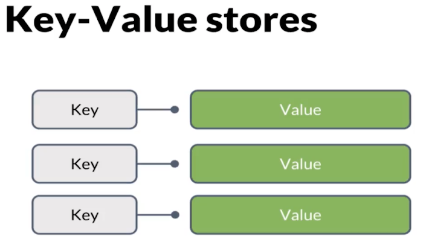
  Son bastante usadas para guardar información en caahse, info de usuarios.
  La simpicidad de su estructura se vuelve dificil de manejar al momento de escalar.
2. Graph databases
  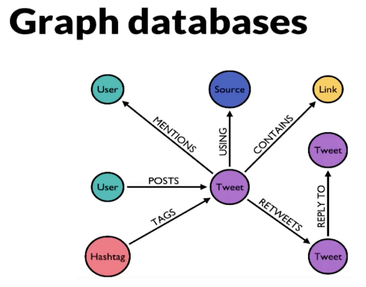
3. Wide-column stores
  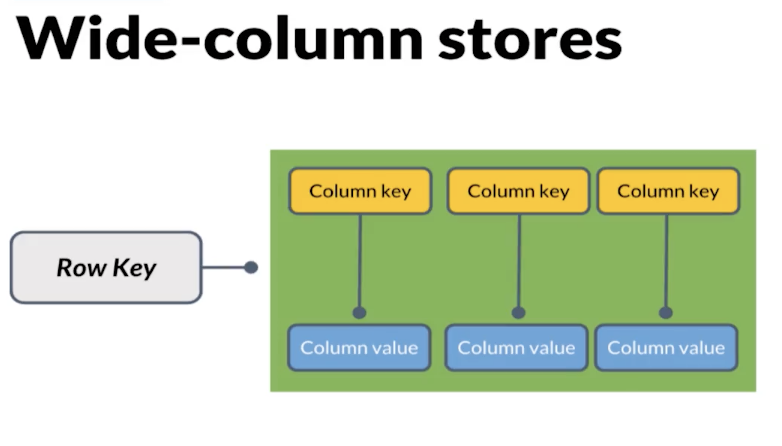
  Se caracterizas por tener dos llaves: Una llave de fila y otra llave de comunas.
  Las dos llaves nos permiten hacer queries mucho más rápidas.
4. Document databases
  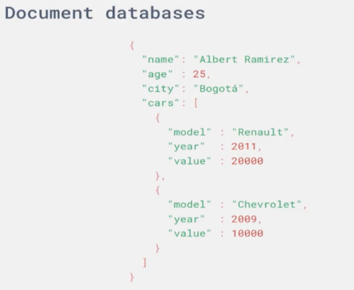
  Permiten guardar documentos (JSON) dentro de sus colecciones.

**Resumen**
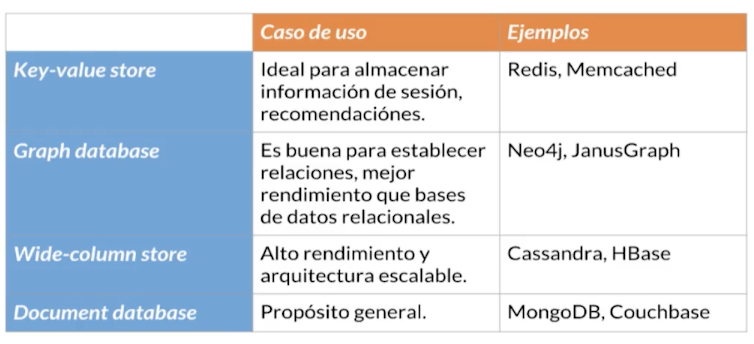

### ¿Qué es mongoDB?, sus caracteristicas y el ecosistema.

**¿Qué es mongo DB?**
MongoDb es:
- Una base de datos no relacional (NoSQL)
- Basada en documentos (JSON -> BSON)
- Base de datos distribuida (facilmente escalable horizontal y verticalmente, muchos servidores = clouster de MongoDB)

**Caracteriticas**
- Nos permite guardar documentos en estructuras similares a las JSON, precisamente se llaman BSON
- Trabaja con schemas ( schema en NoSQL -> Colecciones en SQL) que nos permiten guardar docuemtnos que no necesariamente tengan la misma estructura
- Lenguaje explicito para realizar queries
- Codigo abierto
- Es gratis

**Ecosistema**
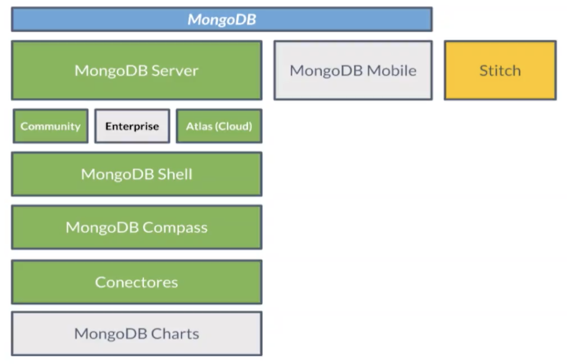

### MongoDb Atlas

**Caracteriticas**
- Aprovisionamiento automático de clusters con MongoDB
- Alta disponibilidad
- Altamente escalable
- Seguro
- Disponible en AWS, GCP y Microsoft Azure
- Fácil monitoreo y optimización

### Lista de comandos en la termina del Mongo DB
- **use nombreDB:** Es el comando para crear una base de datos con el nombre **nombreDB**
- **db:** Es el comando para saber en que BD estoy en este monento
- **show dbs:** Es el comando para mostrar las BD existentes
- **show collections:** Es el comando para mostrar las colleciones en la BD en la que estoy trabajando

### MongoDB + Drivers

**¿Qué son los Drivers en MongoDB?**
Son librerias que utilizamos para couminar nuestra appliacaión con nuestra base de datos. Sin nuestros drivers no podemos trabajar con nuestros cluster de base de datos.

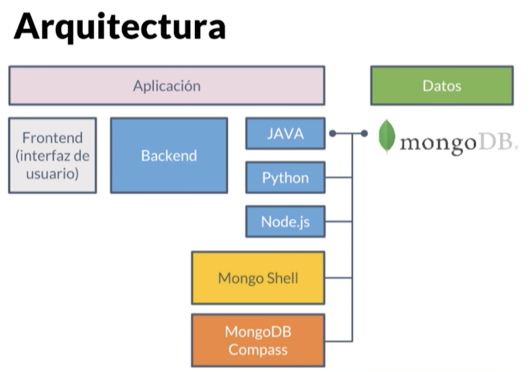

**¿Cómo agregar los drivers dentro de nuestro proyecto?**
Usamos un gestor de dependencias. Lo agregamos en nuestro gestor de dependencia;
- **Python:** ```python -m pip install pymongo```
- **Node.js:** ```npm install mongodb --save```
- **Ruby:** ```gem install mongoid```
- **GO:** ```dep ensure -add go.mongodb.org/mongo-driver/mongo```
- **Java con maven:**
```# build.gradle compile 'org.mongodb:mongo-java-driver:2.12.3'```

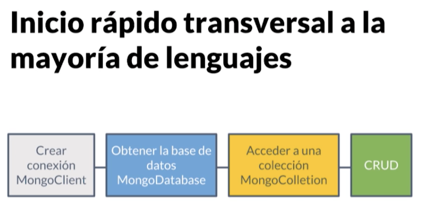

## 2. Operaciones CRUD

- [Cosas-básicas-de-un-crud-en-mongodb](https://platzi.com/tutoriales/1533-mongodb/4102-cosas-basicas-de-un-crud-en-mongodb/)
- [MongoDB CRUD Operations](https://docs.mongodb.com/manual/crud/)
- [MongoDB Cheat Sheet - Official Docs](https://www.mongodb.com/developer/quickstart/cheat-sheet/)
- [MongoDB Cheat Sheet - Dev](https://gist.github.com/bradtraversy/f407d642bdc3b31681bc7e56d95485b6)

### Bases de datos, Colecciones y Documentos en MongoDB
- **Los Cluster** 
  - Son un grupo de servidores.
  - Pueden tener múltiples bases de datos.
- **Las Bases de Datos** 
  - Son los contenedores físicos para nuestras colecciones.
  - Cada base de datos tiene un archivo propio en el sistema de archivos de nuestra computadora o servidor.
- **Las Colecciones** 
  - Son agrupaciones de documentos.
  - Son equivalentes a las tablas en bases de datos relacionales.
  - NO nos imponen un esquema o estructura rígida para guardar información.
- **Los Documentos** 
  - Son registros dentro de las colecciones.
  - Son la unidad básica de MongoDB
  - Son análogos a los objetos JSON pero en realidad son BSON (Binary JSON).

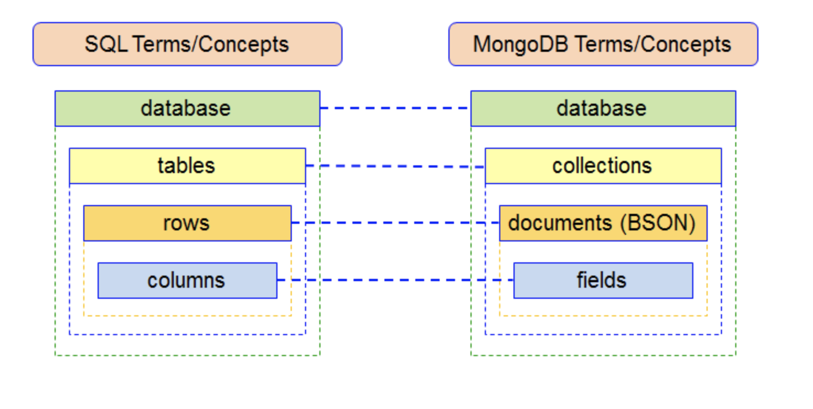

>Un Clouster puede tener varias Bases de datos, en una Base de datos pueden haber muchas colleciones, en la collección pueden haber muchos documentos

- [Atomicity and Transactions](https://docs.mongodb.com/manual/core/write-operations-atomicity/)
- [Query Documents](https://docs.mongodb.com/manual/tutorial/query-documents/)

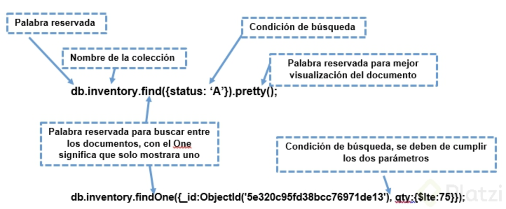
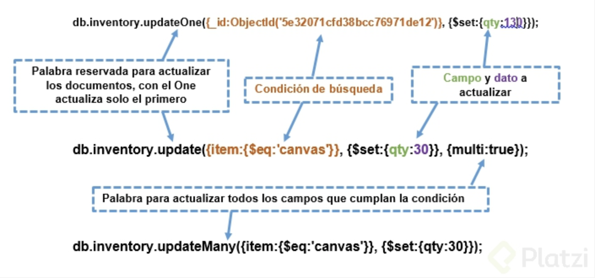

## 3. Esquemas y relaciones

### Tipos de datos

- [BSON Types](https://docs.mongodb.com/manual/reference/bson-types/)
- [MongoDB Limits and Thresholds](https://docs.mongodb.com/manual/reference/limits/)

- **Strings:** Nos sirven para guardar textos.
- **Boolean:** Información cierta o falsa (true y false).
- **ObjectId:** Utilizan el tiempo exacto en el que generamos la consulta para siempre generan IDs únicos. Existen en BSON pero no en JSON.
- **Date:** Nos sirven para guardar fechas y hacer operaciones de rangos entre ellas.
- **Números:** 
  - Double
  - Integer 32 bits
  - Integer 64 bits
  - Decimal -> Más enfocado a información financiera
- **Documentos Embebidos:** Documentos dentro de otros documentos ({ { { }, { }}}).
  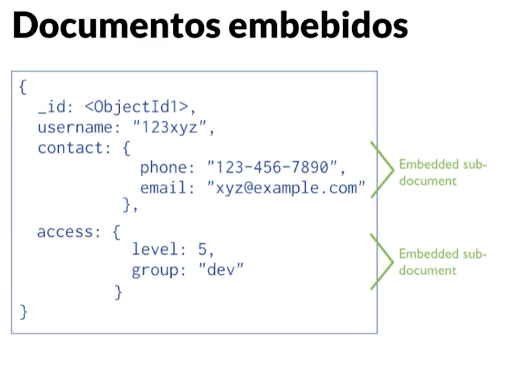
- **Arrays:** Arreglos o listas de cualquier otro tipo de datos, incluso, de otras listas.
  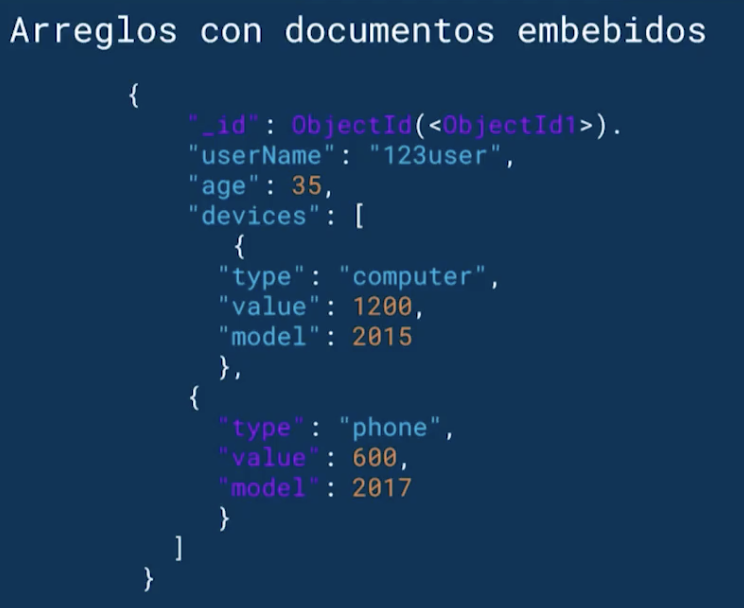

### ¿Qué son los esquemas y las relaciones?

- [¿Que es SQL y NoSQL? - PlatziYoutube](https://www.youtube.com/watch?v=CuAYLX6reXE)
- [que es sql y nosql? cuales son sus diferencias y cuando deberías utilizarlos - HolaMundoYoutube](https://www.youtube.com/watch?v=zmXl2dOGWL8)
- [NoSQL vs SQL - Diferencia entre MongoDB y MySQL - Bases de datos no relacionales - Víctor Robles](https://www.youtube.com/watch?v=b_zr8t2g2Ic)
- **Los esquemas** son la forma en que organizamos nuestros documentos en nuestras colecciones.
  - MongoDB no impone ningún esquema pero podemos seguir buenas prácticas y estructurar nuestros documentos de forma parecida (no igual) para aprovechar la flexibilidad y escalabilidad de la base de datos sin aumentar la complejidad de nuestras aplicaciones.
- **Las relaciones** son la forma en que nuestras entidades o documentos sen encuentran enlazados unos con otros. 
  - Por ejemplo: Una carrera tiene multiples cursos y cada curso tiene multiples clases.

### Relaciones entre documentos

- [Model Relationships Between Documents](https://docs.mongodb.com/manual/applications/data-models-relationships/)

Las documentos embebidos nos ayudan a guardar la información en un solo documento y nos ahorra el tiempo que tardamos en consultar diferentes documentos a partir de referencias. Sin embargo, las referencias siguen siendo muy importantes cuando debemos actualizar información en diferentes lugares de forma continua.

- **One to one:** Documentos embebidos
- **One to many:** Documentos embebidos cuando la información no va a cambiar muy frecuentemente y referencias cuando si.

## 4. Profundización de queries dentro de MongoDB
-[Query Documents](https://docs.mongodb.com/manual/tutorial/query-documents/)
- [Operators](https://docs.mongodb.com/manual/reference/operator/)

### Operadores para realizar queries y proyecciones

- ¿Qué es una Querie?
Es una petición que se realiza a la base de datos por valores 

- ¿Qué es una proyección?
Las proyecciones las usamos cuando queremos traer uno o dos valores al interior de un documento
```js
db.inventory.findOne()({/*FILTRO*/}, {/*VALORES QUE QUEREMOS TRAERNOS*/}})
db.inventory.findOne()({status: "A"}, {item: 1, status:1}})
```

- ¿Qué es un Filtro?
El filtro recibe operadores para especificar que se quiere y como se quiere filtrar
```js
db.inventory.find()({status: {$in: ["A", "B"]}})
```

- **Operadores de comparación en MongoDB.**
  - **$eq:** Igual ‘=’.
  - **$gt:** Mayor ‘>’.
  - **$gte:** Mayor o igual ‘>=’.
  - **$lt:** Menor ‘<’.
  - **$lte:** Menor o igual ‘<=’.
  - **$ne:** Diferente ‘!=’.
  - **$in:** Valores dentro de un arreglo.
  - **$nin:** Valores que no están dentro de un arreglo.
- **Operadores lógicos.**
  - **$and:** Une queries con un and lógico.
  - **$not:** Invierte el efecto de un query.
  - **$nor:** Une queries con un nor lógico.
  - **$or:** Une queries con un or lógico.
- **Operadores por elemento.**
  - **$exist:** Documentos que cuentan con un campo específico.
  - **$type:** Documentos que cuentan con un campo de un tipo específico.
- **Operadores para arreglo.**
  - **$all:** Arreglos que contengan todos los elementos de la query.
  - **$elementMatch:** Documentos que cumplen la condición del $elementMatch en uno de sus elementos.
  - **$size:** Documentos que contienen un capo tipo arreglo de un tamaño específico.

### Operaciones avanzadas con Agregaciones

- [Aggregation](https://docs.mongodb.com/manual/aggregation/)
- [MongoDB Aggregation Pipeline by Example: Part 1](https://codeburst.io/mongodb-aggregation-pipeline-by-example-part-1-77accb976bd0)

Las agregaciones son operaciones avanzadas que podemos realizar sobre nuestra base de datos con un poco más de flexibilidad en nuestros documentos.

**Pipeline de Agregaciones:** Es un grupo de multiples etapas que ejecutan agregaciones en diferentes momentos. Debemos tener muy en cuenta el performance de nuestras agregaciones porque las agregaciones corren en todo el cluster.

**Map-Reduce:** Nos permite definir funciones de JavaScript para ejecutar operaciones avanzadas. La función de map nos permite definir o “mappear” los campos que queremos usar y la función reduce nos permite ejecutar operaciones y devolver resultados especiales. Por ejemplo: podemos mappear algunos campos y calcular la cantidad de elementos que cumplen ciertas condiciones.

**Agregaciones de propósito único:** Funciones ya definidas que nos ayudan a calcular un resultado especial pero debemos tener cuidado porque pueden mejorar o afectar el performance de la base de datos. Por ejemplo: count(), estimatedDocumentCount y distinct.

## 5. Python con MongoDB (opcional)
## 6. Recomendaciones para poner en producción tu cluster de Atlas
